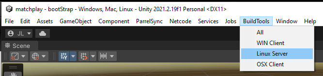
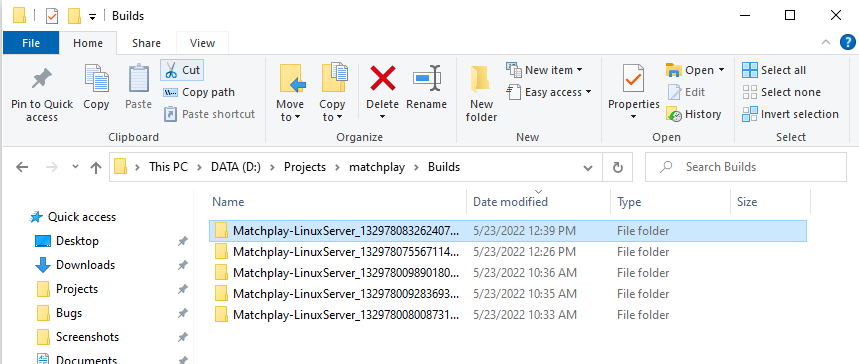
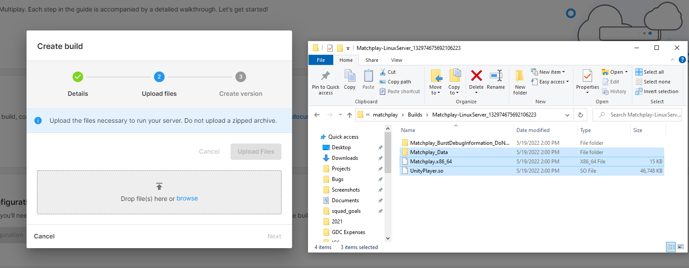
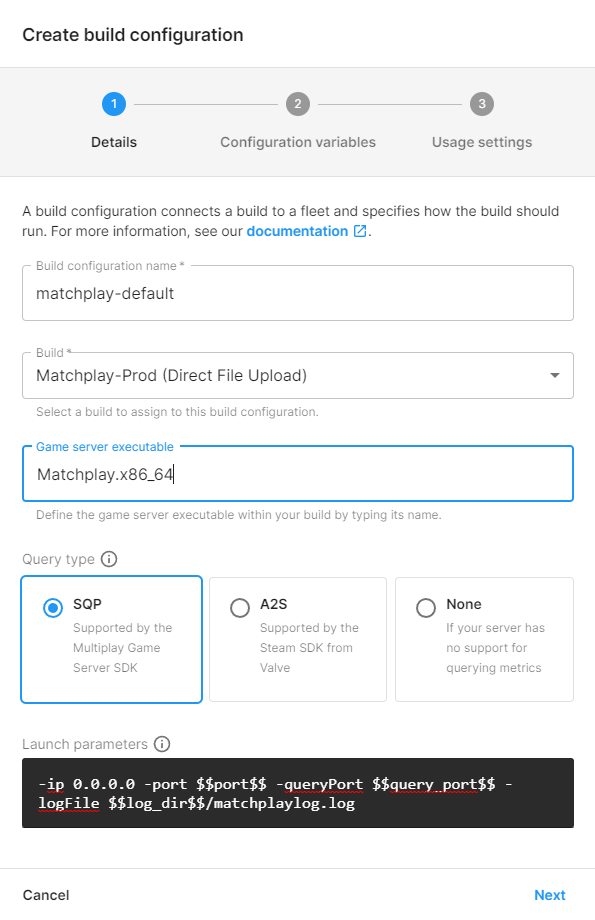
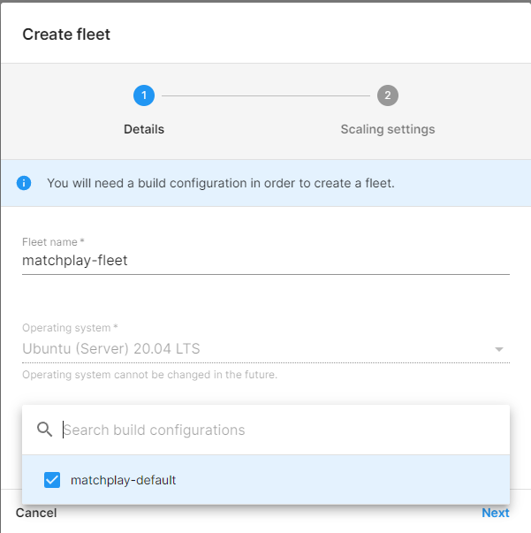

# Matchplay - Matchmaker + Multiplay Sample

_Tested with Unity 2021.2 for PC and OSX clients, and Linux Headless servers._

This sample demonstrates how to create a _Matchmake_ button; a basic networked client-server game with a matchmaking feature from end to end using the Unity Engine and Cloud Services SDK.

Note This is not a “drag-and-drop” solution; the Matchplay Sample is not a minimal code sample intended to be completely copied into a full-scale project. Rather, it demonstrates how to use multiple services in a vertical slice with some basic game logic and infrastructure. Use it as a reference to learn how Matchmaker and Multiplay work together to make a common end-user feature.

## Features

* **Matchmaking Ticket Config**: Players can set their preferences for the map and game mode they want.\
* **Matchmaking**: Players can click the **Matchmake** button to begin looking for a match.\
* **Matchmaker Allocation Payload**: The server gets information about the match and configures the server accordingly.\
* **Multiplay Server Allocation**: Spins up a dedicated cloud server and passes its information to the player.\
* **Client Server Netcode**: A lightweight server that can be hosted on Multiplay.

## Project Overview

The Project can run in client or server modes, and in local service modes. 
The server will attempt to find services for 5 seconds, and if it can’t, will start the server with some default settings for local testing. The client can directly connect to this server via the local host ip. 

 
### Scenes

* **bootStrap** - You must play from this scene for things to work.\
* **mainMenu** - Displays the matchmake and local connection buttons to users.\
* **game_lab** - A game scene with a table.\
* **game_space** - A game scene which features a sphere!

### Run as a Client

The Project will run as a client in the following scenarios:

* You play the matchplay project in-editor from **bootStrap** scene.
* You run a non-server build on your platform of choice.
* You play a ParrelSync clone project with “client” in the arguments field from **bootStrap** scene.

The client can either connect using the Matchmaker or through a local connection with the UI.

Matchmaker won't run without services being set up, follow the the [Sample Setup Guide](#Sample-Setup-Guide) below to set them up.

### Run as Server

The project will run as a server in the following scenarios:

* You run a server build on your platform of choice.
* You run a Parrelsync clone project with “server” in the argument field from **bootStrap** scene.
* Multiplay will run the server automatically when the matchmaker finds a match.

Depending on the context the server is running in, it will either fetch its configuration from the matchmaker or it starts with the default values.

### Test Netcode Locally With ParrelSync

To test Netcode locally with ParrelSync:

1. Go to the top bar and select **ParrelSync > Clones Manager** and select **Add new Clone.** This will duplicate your project folder and synchronize the contents, allowing you to iterate back and forth.
2. Input "server" in the arguments field so the clone plays in local server mode.
3. Once the server starts, return to the base project and select Play.
4. Once the mainMenu scene loads, select local and Play to connect to the local server.

**Note**: The default IP for local servers is (127.0.0.1:7777).

### Cloud Project and Organization

To use Unity’s multiplayer services, you need a cloud organization ID for your project. Follow the
[How do I create a new Organization](https://support.unity.com/hc/en-us/articles/208592876-How-do-I-create-a-new-Organization-) guide to setup your org.

To learn how to connect your project with services, follow the [Setting up Project Services](https://docs.unity3d.com/Manual/SettingUpProjectServices.html) guide.

### Services

#### Authentication

Matchmaker and Multiplay depend on [Unity Authentication 2.0](https://docs.unity3d.com/Manual/com.unity.services.authentication.html) for credentials. This sample uses Unity Auth’s anonymous login feature to create semi-permanent credentials that are unique to each player but do not require developers to maintain a persistent account for them.

#### Matchmaker

The [Matchmaker Service](http://docs.unity.com/matchmaker) allows players to search for other players with the same preferences as them and put them in a match together.

The Matchmaker documentation contains code samples and additional information about the service. It includes comprehensive details for using the Matchmaker along with additional code samples, and it might help you better understand the Matchplay sample. 

The Matchmaker service can be managed in the [Unity Dashboard](https://dashboard.unity3d.com/matchmaker).

#### Multiplay

The [Multiplay Service](http://documentation.cloud.unity3d.com/en/collections/3254305-multiplay-self-serve) hosts game servers in the cloud to allow for easy connection between players from around the world with the best ping performance possible.

The Multiplay documentation contains code samples and additional information about the service. It includes comprehensive details for using Multiplay along with additional code samples, and it might help you better understand the Matchplay Sample.

The Multiplay service can be managed in the [Unity Dashboard](https://dashboard.unity3d.com/multiplay)

## Sample Setup Guide

1. If you have not already done so, hook up your Editor project to the Cloud Project as described in the [Cloud Project and Organization](#Cloud-Project-and-Organization) chapter.

2. To build the server, go to your Matchplay project, and select **BuildTools > Linux Server**.

It should automatically build out your project as a server build, and output it to \
<_project root_>/Builds/Matchplay-<_platformBuildType_>_<_dateTime_>

3. Next, upload the server to Multiplay and configure server hosting. Go to your Unity Dashboard and then go to **Multiplay Setup Guide > Create a build**.
4. Fill out the **Details** fields and move to **Upload Files**. Drag your **Linux Headless Build** into the dropbox and select **Upload Files**.

5. Continue to set up the build configuration. Complete the fields and enter **Matchplay.x86_64** in the game server executable field.
6. Select SQP for your Query type, and fill in the following as Custom launch parameters 
_-ip 0.0.0.0 -port $$port$$ -queryPort $$query_port$$ -logFile $$server_log_dir$$/matchplaylog.log_

7. To create a fleet, enter a fleet name, and select the previously created build configuration. For the scaling settings, select 1 as the minimum available, and 5 as the maximum. The Multiplay fleet is now ready.

### Unity Matchmaking

Now that we have our server fleet, we can set up the Matchmaker. Select Matchmaker Setup Guide. You can click through Integrate Matchmaker for this guide, as the sample already has it integrated in the project.

1. Select **Create Queue** and enter a name for the queue. The queue name must be between 1 and 36 characters and contain only alphanumeric or hyphen characters.
2. Name the queue 'casual-queue' and set the maximum players on a ticket to 10.

3. The exact string queue name defined in the UDash must match the input string in the following SDK sample:

4. To create a pool, select your previously created Multiplay fleet and build configuration. Set the timeout to 15 seconds.

**Note**: If your server fleet scaling settings have 0 min servers you may need to increase the timeout duration to 180 seconds to accommodate the server initial startup duration.

#### Match Rules

The match rules are the filters that we use in the sample to match the players by their preferences. Within the pools and queues, every player’s settings are evaluated against every other player.

To set up the match definition rules:
1. Set up the region you are playing from. This should be the same as your server fleet region. 
2. Set up the basic team definitions, and skip the advanced rules for now.
3. Select **Finish** to finalize the configuration of the matchmaker. 

